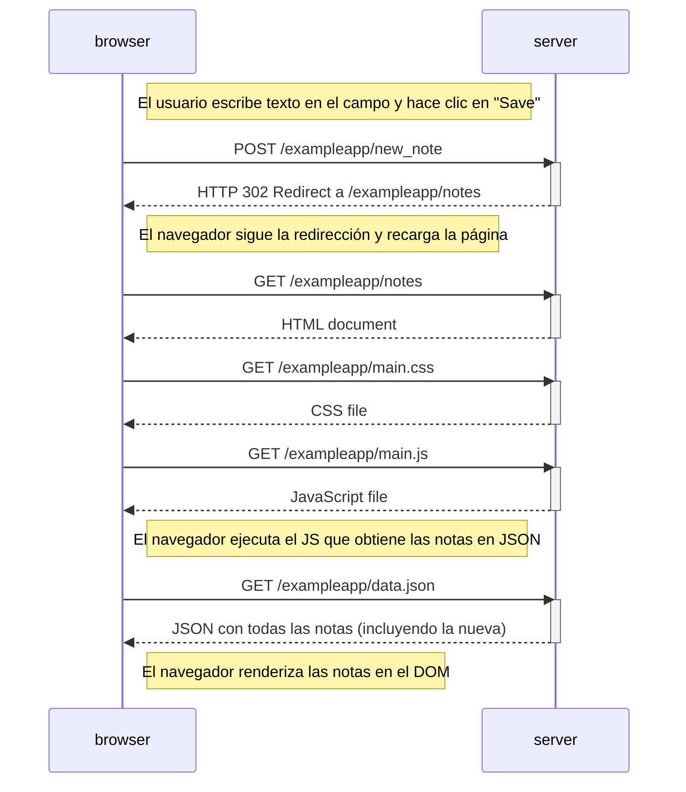

```mermaid
sequenceDiagram
    participant browser
    participant server

    Note right of browser: El usuario escribe texto en el campo y hace clic en "Save"

    browser->>server: POST /exampleapp/new_note
    activate server
    server-->>browser: HTTP 302 Redirect a /exampleapp/notes
    deactivate server

    Note right of browser: El navegador sigue la redirección y recarga la página

    browser->>server: GET /exampleapp/notes
    activate server
    server-->>browser: HTML document
    deactivate server

    browser->>server: GET /exampleapp/main.css
    activate server
    server-->>browser: CSS file
    deactivate server

    browser->>server: GET /exampleapp/main.js
    activate server
    server-->>browser: JavaScript file
    deactivate server

    Note right of browser: El navegador ejecuta el JS que obtiene las notas en JSON

    browser->>server: GET /exampleapp/data.json
    activate server
    server-->>browser: JSON con todas las notas (incluyendo la nueva)
    deactivate server

    Note right of browser: El navegador renderiza las notas en el DOM
```