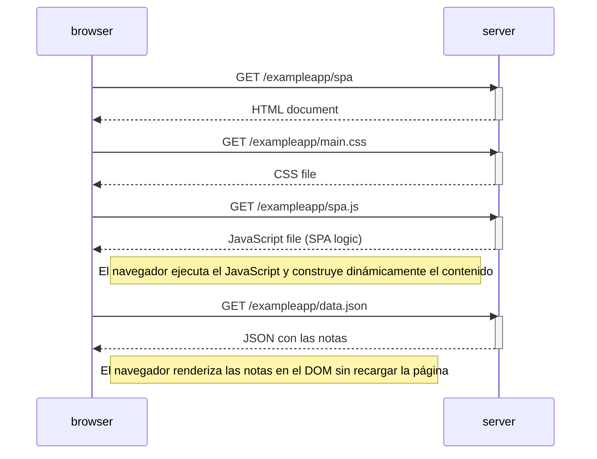

```mermaid
sequenceDiagram
    participant browser
    participant server

    browser->>server: GET /exampleapp/spa
    activate server
    server-->>browser: HTML document
    deactivate server

    browser->>server: GET /exampleapp/main.css
    activate server
    server-->>browser: CSS file
    deactivate server

    browser->>server: GET /exampleapp/spa.js
    activate server
    server-->>browser: JavaScript file (SPA logic)
    deactivate server

    Note right of browser: El navegador ejecuta el JavaScript y construye dinámicamente el contenido

    browser->>server: GET /exampleapp/data.json
    activate server
    server-->>browser: JSON con las notas
    deactivate server

    Note right of browser: El navegador renderiza las notas en el DOM sin recargar la página
```