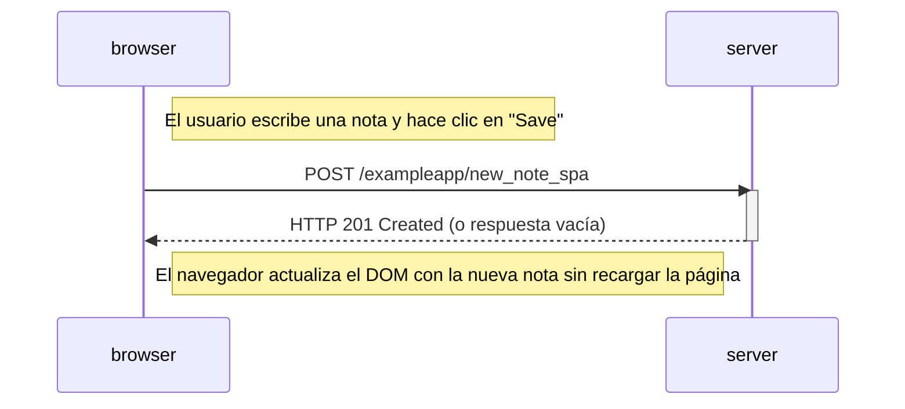

```mermaid
sequenceDiagram
    participant browser
    participant server

    Note right of browser: El usuario escribe una nota y hace clic en "Save"

    browser->>server: POST /exampleapp/new_note_spa
    activate server
    server-->>browser: HTTP 201 Created (o respuesta vacía)
    deactivate server

    Note right of browser: El navegador actualiza el DOM con la nueva nota sin recargar la página
```